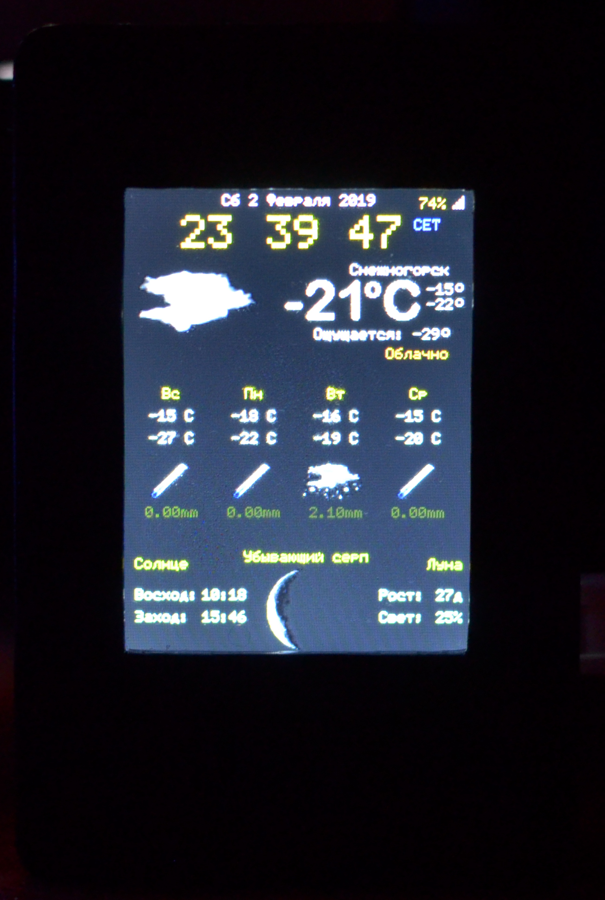
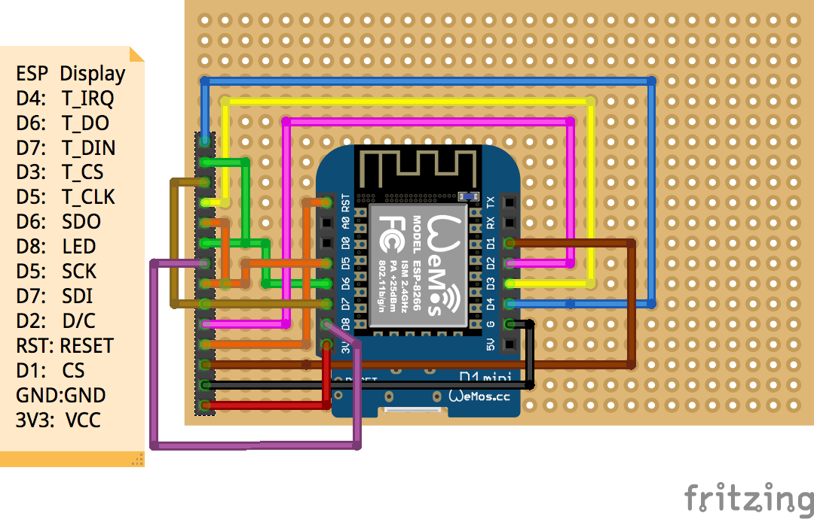

# ESP8266-Weather-Station-AccuWeather

ESP8266 Weather Station in Color using ILI9341 TFT 240x320 display
Supports two language (Russian and English)

| Wemos D1 Mini | ILI9341      |
| ------------- |:-------------:|
| D4            | T_IRQ         |
| D6            | T_DO          |
| D7            | T_DIN         |
| D3            | T_CS          |
| D5            | T_CLK         |
| D6            | SDO           |
| D8            | LED           |
| D5            | SCK           |
| D7            | SDI           |
| D2            | D/C           |
| RST           | RESET         |
| D1            | CS            |
| GND           | GND           |
| 3V3           | VCC           |
